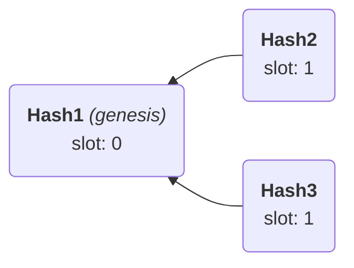

# SMT-based specification of 3SF

This directory contains a constraint-based encoding of the abstract 3SF protocol.  
It was produced as a by-product of our model-checking work on 3SF.

We encode the high-level definitions of 3SF (checkpoints, FFG votes,
justification & finalization votes, slashing conditions) using [SMT constraints][SMT].
In particular, we make use of the decision procedure for finite sets and
cardinality constraints[^1] in the [CVC5 solver][CVC5].

This allows us to check Accountable Safety for small models of the protocol.

## Experiments

The specification lives in [`./ssf.smt`](./ssf.smt).  
We conducted experiments using CVC5 v1.2.0.

```sh
$ cvc5 --version
This is cvc5 version 1.2.0 [git tag 1.2.0 branch HEAD]
```

The expected output is:

```sh
$ cvc5 ssf.smt
"searching for accountable safety violation [expect unsat]"
unsat
```

### Performance evaluation

We obtained the following runtimes on a Nov 2023 14" Macbook Pro (Apple M3 Pro):

| # blocks | # checkpoints | runtime |
|----------|---------------|---------|
|   3      |      5        |  20sec  |
|   4      |      5        |  96sec  |
|   5      |      5        |   8min  |
|   3      |      6        |  74min  |

The script in [`./benchmark_ssf.py`](./benchmark_ssf.py) can be used to do a grid search over parameters.

## Examples: Querying reachable program states

Besides checking Accountable Safety, we can use the SMT solver to discover interesting reachable protocol states within seconds.

Some example queries have been pre-written in the *Examples* section of the SMT file.  
To check them, simply uncomment the respective section and run CVC as above.

An example output:

```sh
$ grep -A 3 "find conflicting blocks" ssf.smt
; find conflicting blocks
(assert (not (= conflicting_blocks (as set.empty (Relation Hash Hash)))))
(check-sat)
(get-model)

$ cvc5 ssf.smt
sat
(
(define-fun genesis () Hash Hash1)
(define-fun parent_of (($x1 Hash)) Hash Hash1)
(define-fun slot (($x1 Hash)) Int (ite (= Hash3 $x1) 1 (ite (= Hash2 $x1) 1 0)))
(define-fun conflicting_blocks () (Set (Tuple Hash Hash)) (set.union (set.singleton (tuple Hash3 Hash2)) (set.singleton (tuple Hash2 Hash3))))
[...]
)
```

Here, the SMT solver has found an example of conflicting blocks `Hash2` and `Hash3`.  
The encoded graph looks like this, and indeed contains these conflicting blocks:



You can use CVC5 to find and enumerate more complex scenarios, e.g.,
justification or slashing conditions.

[CVC5]: https://cvc5.github.io/
[SMT]: https://en.wikipedia.org/wiki/Satisfiability_modulo_theories

[^1]: Kshitij Bansal, Clark W. Barrett, Andrew Reynolds, and Cesare Tinelli. A new decision procedure for finite sets and cardinality constraints in SMT. CoRR, 2017. [arXiv:1702.06259](https://arxiv.org/abs/1702.06259).
